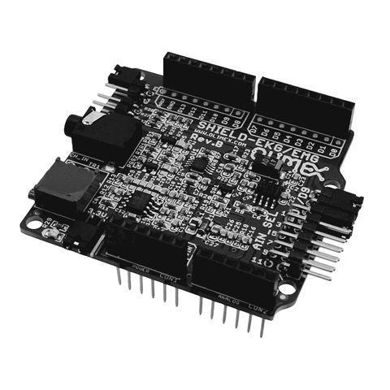
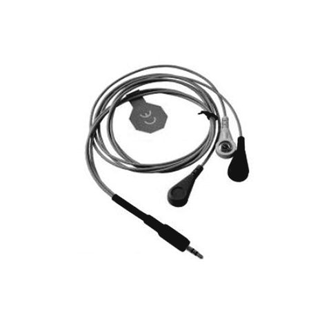

# olimex-shield

Record EEG, ECG or EMG with an **Arduino UNO and an Olimex SHIELD-EKG-EMG**, a single-channel
amplifier that costs about C$75 with the Arduino. This repo holds the sketch that runs on the board, a small
bridge that reads it over USB and checks whether the signal can be trusted, and a browser workbench to
watch, record, tag, play back and export to [EEG-BIDS](https://bids-specification.readthedocs.io/).

It was built for the Polarize.Tech post
[*Can a $70 board tell me I'm wrong?*](https://polarize.tech/blog/can-a-70-dollar-board-tell-me-im-wrong/), which characterises the rig in numbers.

> **This is not a medical device.** It is a hobby amplifier, and nothing it shows is a diagnosis.
> Read [Safety](#safety) before you put an electrode on anyone.

## The rig

<p>
  
  
</p>

<sub>The Olimex SHIELD-EKG-EMG and its SHIELD-EKG-EMG-PRO electrode cable. Photos: DigiKey, as used in
the blog post.</sub>

| Part | Role |
|---|---|
| [Olimex SHIELD-EKG-EMG](https://www.olimex.com/Products/Duino/Shields/SHIELD-EKG-EMG/) | Analog front end, 0.16–40 Hz, one differential channel |
| Olimex SHIELD-EKG-EMG-PRO cable | 3.5 mm jack to three snap leads |
| Arduino UNO R3 | 10-bit converter and USB serial |
| Snap electrodes | Disposable gel electrodes are best. The post used self-adhesive TENS pads, which are made for stimulation, not recording. Never ultrasound gel. |

Wiring and flashing: [`apps/olimex-shield/README.md`](apps/olimex-shield/README.md).

## Quick start

You need Python 3.10+ and, for the hardware, `pyserial`.

```bash
git clone https://github.com/polarizetech/olimex-shield && cd olimex-shield
python3 -m pip install pyserial
python3 apps/web/serve.py
```

Open <http://127.0.0.1:8150/>. No board yet? Pick `demo://synthetic`. Synthetic data is badged as
synthetic everywhere it goes, including recordings and exports.

## What it can and cannot see

| | |
|---|---|
| Band | 0.16–40 Hz, set in hardware before the converter. Software cannot recover anything outside it. |
| Sample rate | 250 Hz declared. The bridge measures the real rate, which runs slightly slow and drifts. |
| Resolution | 10-bit. The µV scale comes from the shield's built-in cal signal at its nominal amplitude and **has not been checked externally** (see [hardware notes](docs/hardware.md)). |
| Intended for | Resting alpha, ECG rhythm, muscle on/off. None of these is validated against a reference amplifier yet. |
| Not for | Brainstem responses (they sit far above 40 Hz), skin conductance, or anything clinical. |

## Documentation

- [Hardware notes](docs/hardware.md): what was measured on this board, and what is still open
- [Recording, playback, uploads and BIDS export](docs/recording.md)
- [Standards and roadmap](docs/standards.md)
- [Versioning and preregistration](docs/versioning.md): how changes to the measuring chain are
  versioned, and how claims about the rig are predicted before they are tested
- [Experimental features](docs/experimental.md): analysis that is not established practice
- [Bridge internals](apps/server/README.md)

## Safety

The workbench shows this list in full before every connection. Here it is too:

1. This is NOT a medical device and nothing it shows is a diagnosis. If you are worried about your heart, your brain or your skin, this app is not the instrument to use.
2. Run the board from a BATTERY-POWERED laptop, unplugged from mains. A mains-powered USB host puts your body between a wall socket and an electrode; the Olimex shield is not a medically isolated front end.
3. Unplug EVERY mains-connected device from the laptop, not only the charger: an external monitor or HDMI cable, a powered USB hub or dock, an Ethernet cable, and any mains-powered audio interface or headphone amplifier used for stimuli. Each one is a path from mains, through the laptop, to the electrodes.
4. If you cannot run on battery, a "properly isolated" power supply alone is NOT enough: isolate the USB data line too, with a USB isolator rated for patient connection (medical isolation, e.g. to IEC 60601-1). A general-purpose USB isolator is not a substitute.
5. Never connect an electrode to anyone with an implanted pacemaker, ICD, or any other active implanted device.
6. Never give current a path across the chest. While anything mains-referenced is connected, do not place electrodes on both arms or on both sides of the chest -- an arm-to-arm or side-to-side pair puts the heart in that path. That includes this app's own ECG limb leads: record them on battery only, with nothing else plugged in.
7. Do not touch grounded metal -- a radiator, a tap, a desktop PC's case -- while you are wired up. It gives any fault current a return path through you.
8. Do not place electrodes on broken skin, on a rash, or over a wound.
9. Stop immediately if the skin stings, burns, itches or reddens under an electrode.
10. This app applies no current and delivers no stimulation of any kind. It only listens. If any part of the rig ever produces a sensation, disconnect it.
11. One person, one rig, one session. Do not connect two people to the same amplifier.

## Tests

```bash
python3 scripts/check.py
```

## Status, citing and license

Released as-is for people who want to build the same rig; it is not yet packaged as a
community open-source project. Versions are tagged, so download the latest release.

Cite with [`CITATION.cff`](CITATION.cff). MIT licensed, see [`LICENSE`](LICENSE). Vendored third-party
files keep their own licences: the fonts in `apps/web/vendor/design/fonts/` are SIL OFL (licence text
beside each font), and the icons are a subset of [Phosphor Icons](https://github.com/phosphor-icons/core)
(MIT, © Phosphor Icons).
